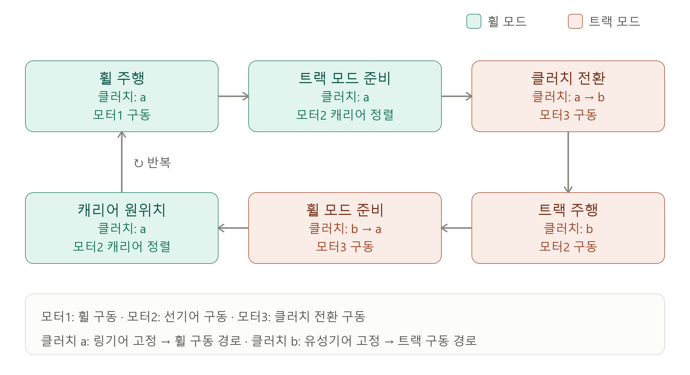

# 휠 ↔ 트랙 모드 전환 시퀀스



## 1. 용어 정의

| 명칭 | 역할 |
|---|---|
| 모터1 | 휠 구동 모터 |
| 모터2 | 선기어 구동 모터 |
| 모터3 | 클러치 전환 모터 |
| 클러치 a | 링기어 고정. 모터2가 선기어를 회전시키면 유성기어와 연결된 캐리어가 회전 |
| 클러치 b | 유성기어 측 고정. 모터2가 선기어를 회전시키면 링기어가 회전하여 트랙을 구동 |

## 2. 전체 동작 흐름

1. **휠 주행**
   - 클러치 `a` 상태에서 모터1 구동
   - 모터2와 모터3 정지

2. **트랙 모드 준비**
   - 모드 전환 입력 시 모터1 정지
   - 정지 확인 후 모터2로 캐리어를 단차 대응 목표 각도까지 정렬
   - 목표 각도 도달 후 모터2 정지

3. **클러치 전환**
   - 모터3을 구동하여 클러치를 `a → b`로 전환
   - 클러치 `b` 체결 확인 후 모터3 정지

4. **트랙 주행**
   - 클러치 `b` 상태에서 모터2 구동
   - 모터1과 모터3 정지

5. **휠 모드 준비**
   - 모드 전환 입력 시 모터2 정지
   - 정지 확인 후 모터3을 구동하여 클러치를 `b → a`로 전환
   - 클러치 `a` 체결 확인 후 모터3 정지

6. **캐리어 원위치**
   - 모터2로 캐리어를 휠 주행 기준 각도까지 정렬
   - 목표 각도 도달 후 모터2 정지
   - 1번 휠 주행 상태로 복귀하여 동일한 루프 반복

## 3. 흐름 검토 결과

제안한 순서는 기구의 동력 전달 관계에 부합하며, `휠 주행 → 캐리어 정렬 → 클러치 b 체결 → 트랙 주행 → 클러치 a 복귀 → 캐리어 원위치 → 휠 주행`의 상태 흐름도 타당하다.

단, 각 단계는 단순한 시간 지연이 아니라 실제 완료 신호를 확인한 뒤 넘어가야 한다. 특히 다음 조건은 필수 인터록으로 구현한다.

- 모터1이 완전히 정지하기 전에는 캐리어 정렬을 시작하지 않는다.
- 모터2가 완전히 정지하기 전에는 모터3을 동작하지 않는다.
- 클러치 `b` 체결이 확인되기 전에는 트랙 주행을 허용하지 않는다.
- 클러치 `a` 체결이 확인되기 전에는 캐리어 원위치 정렬과 휠 주행을 허용하지 않는다.
- 모터3이 동작하는 동안 모터1과 모터2는 반드시 정지한다.
- 전환 중 통신 두절, 센서 이상 또는 제한 시간 초과가 발생하면 모든 모터를 정지하고 오류 상태로 전환한다.

## 4. 권장 상태 머신

```text
WHEEL_DRIVE
  → PREPARE_TRACK_MODE
  → SHIFT_CLUTCH_TO_B
  → TRACK_DRIVE
  → PREPARE_WHEEL_MODE
  → ALIGN_CARRIER_FOR_WHEEL
  → WHEEL_DRIVE
```

각 전환 상태에는 최소한 다음 정보가 필요하다.

- 진입 시 실행할 모터 명령
- 다음 상태로 넘어가기 위한 완료 조건
- 최대 허용 시간
- 센서 오류 또는 시간 초과 시 이동할 오류 상태

## 5. 추후 확정할 제어값

| 항목 | 필요한 값 |
|---|---|
| 모터2 캐리어 정렬 | 감속비, 엔코더 분해능, 트랙 모드 목표 각도, 휠 모드 기준 각도, 허용 오차 |
| 모터2 트랙 주행 | 감속비, 목표 출력축 RPM, 가속·감속률, 최대 PWM 또는 전류 |
| 모터3 클러치 | a/b 위치 검출 방식, 구동 방향, 최대 구동 시간, 체결 완료 조건 |
| 모터1 휠 주행 | 목표 RPM 또는 이동 속도, 가속·감속률, 정지 판정 기준 |

모터3의 위치를 확실히 판정할 수 있도록 클러치 `a`, `b` 위치에 각각 리미트 스위치 또는 위치 센서를 두는 것을 권장한다. 캐리어 정렬은 모터2의 엔코더와 원점 센서를 함께 사용하면 전원 재인가 후에도 기준 위치를 복구하기 쉽다.

## 6. 제어 코드 역할 분담

```text
Python
사용자 입력과 로봇 전체 목표 결정
        ↓ USB Serial
ESP32
명령 배포와 4개 STM32 상태 취합
        ↓ I2C
STM32 0x10 · 0x11 · 0x12 · 0x13
각 모듈의 모터1·2·3 정밀 제어
```

기본 원칙은 다음과 같다.

> Python은 무엇을 할지 결정하고, ESP32는 누구에게 전달할지 관리하며, STM32는 센서를 이용해 실제 기구를 안전하고 정확하게 움직인다.

### 6.1 Python: 상위 제어기

Python은 사용자 조작을 로봇 전체의 목표로 변환한다.

- 휠 또는 트랙 주행 모드 선택
- 모드 전환 요청
- 목표 주행 속도와 방향 결정
- 캐리어의 트랙 모드 목표 각도 설정
- 캐리어의 휠 모드 기준 각도 설정
- 4개 모듈의 진행 상태 표시
- 전체 모듈의 완료 여부 판단
- 전환 취소, 정지 및 비상 정지 요청

Python은 PWM이나 모터 구동 시간을 직접 지시하지 않는다. 다음과 같이 최종 목표를 전달한다.

```text
로봇을 트랙 모드로 전환
캐리어를 120.0도로 이동
트랙을 35.0 RPM으로 구동
모든 모터 정지
```

Python의 로봇 전체 상태는 다음과 같이 관리할 수 있다.

```text
WHEEL
SWITCHING_TO_TRACK
TRACK
SWITCHING_TO_WHEEL
FAULT
```

4개 STM32 중 하나라도 전환에 실패하면 정상 주행 상태로 넘어가지 않고 `FAULT`로 전환한다.

### 6.2 ESP32: 통신 허브

ESP32는 Python과 각 STM32 사이의 명령 및 상태를 중계한다.

- Python 명령 수신 및 형식 검사
- 목적지 STM32 주소 선택
- 개별 또는 전체 STM32에 명령 전달
- 각 STM32 상태의 주기적 조회
- 취합한 상태를 Python에 전달
- 체크섬을 통한 패킷 오류 검사
- 통신 두절 감시 및 정지 명령 전송
- 비상 정지 명령의 최우선 처리

STM32 주소는 다음과 같이 사용한다.

| 대상 | I2C 주소 |
|---|---:|
| 좌전 모듈 | `0x10` |
| 우전 모듈 | `0x11` |
| 좌후 모듈 | `0x12` |
| 우후 모듈 | `0x13` |
| 전체 모듈 | Python-ESP32 패킷에서 `0xFF`로 표현 |

전체 명령을 받으면 ESP32가 같은 명령을 `0x10`부터 `0x13`까지 전달한다. 현재 ESP32 시험 코드의 `ACTIVE_LEG_COUNT`는 `1`이므로, 4개 모듈 연결 단계에서 `4`로 변경해야 한다.

모듈 간 시작 시점 동기화가 필요한 경우 목표값 설정과 실행을 분리한다.

```text
1. PREPARE: 모든 STM32에 목표값 전달
2. START: 모든 STM32에 실행 명령 전달
```

### 6.3 STM32: 로컬 실시간 제어기

각 STM32는 해당 모듈의 모터1·2·3을 직접 제어한다.

- 엔코더, 원점 센서 및 리미트 스위치 판독
- 감속비를 적용한 실제 출력축 각도와 RPM 계산
- 위치 또는 속도 PID 제어
- PWM과 회전 방향 출력
- 가속·감속 제한
- 상태 머신 실행
- 모터 간 인터록 적용
- 제한 시간 초과 및 센서 오류 감지
- 통신과 무관한 로컬 비상 정지
- 현재 상태와 오류 코드를 ESP32에 보고

Python이 모드 전환의 최종 목표를 결정하더라도, 안전과 직접 연결되는 세부 전환 절차는 STM32가 수행한다. 예를 들어 Python은 `TRACK 모드로 전환` 명령 하나를 보내고 STM32는 모터1 정지, 캐리어 정렬, 클러치 전환 및 완료 판정을 자체적으로 수행한다.

## 7. 모터별 제어 방식

### 7.1 모터1: 휠 속도 제어

모터1은 휠 주행 상태에서 목표 RPM 또는 목표 이동속도를 추종한다.

```text
목표 휠 RPM - 측정 휠 RPM
            ↓
          속도 PID
            ↓
       방향 및 PWM 출력
```

목표 이동속도 `v`를 휠 RPM으로 변환할 경우 다음 식을 사용한다.

```text
휠 RPM = v / (2 × π × 휠 반지름) × 60
```

### 7.2 모터2: 위치 제어와 속도 제어 전환

모터2는 클러치 상태에 따라 역할이 달라진다.

| 클러치 | 모터2의 역할 | 제어 방식 |
|---|---|---|
| `a` | 캐리어를 목표 각도로 정렬 | 위치 제어 |
| `b` | 링기어를 통해 트랙 구동 | 속도 제어 |

따라서 모터2에는 다음 제어 모드가 필요하다.

```text
MOTOR2_IDLE
MOTOR2_POSITION_CONTROL
MOTOR2_SPEED_CONTROL
```

### 7.3 모터3: 클러치 종단 위치 제어

모터3은 클러치 `a`와 `b`의 두 종단 위치를 이동한다. 각 위치에 리미트 스위치 또는 위치 센서를 두는 방식을 권장한다.

```text
a → b 명령
  → 모터3 정방향 구동
  → b 위치 센서 확인
  → 모터3 정지
```

```text
b → a 명령
  → 모터3 역방향 구동
  → a 위치 센서 확인
  → 모터3 정지
```

목표 센서가 정해진 시간 안에 입력되지 않으면 모터3을 정지하고 클러치 시간 초과 오류로 전환한다.

## 8. 감속비와 엔코더 환산

감속비는 PWM 값을 단순히 나누는 값이 아니다. 엔코더 카운트를 실제 출력축 각도와 RPM으로 환산할 때 사용한다.

엔코더가 모터축에 설치된 경우 출력축 1회전당 카운트는 다음과 같다.

```text
출력축 1회전 카운트
= 엔코더 CPR × 감속비
```

엔코더 사양이 PPR로 주어졌다면 1체배·2체배·4체배 중 실제 판독 방식을 반영해 CPR을 계산해야 한다.

```text
출력축 각도[deg]
= 엔코더 카운트 × 360
  / (엔코더 CPR × 감속비)
```

예를 들어 엔코더 CPR이 `44`, 감속비가 `30:1`이면 출력축 1회전은 `1320 count`이다. 출력축 90도에 해당하는 목표 카운트는 `330 count`이다.

모터2는 유성기어 구조이므로 클러치 `a`와 `b`에서 선기어·링기어·캐리어의 속도 관계가 다르다. 단순 감속비뿐 아니라 선기어와 링기어 잇수를 반영한 관계식을 각 클러치 상태별로 적용해야 한다.

## 9. STM32 로컬 상태 머신

```text
WHEEL_DRIVE
  → PREPARE_TRACK_MODE
  → SHIFT_CLUTCH_TO_B
  → TRACK_DRIVE
  → PREPARE_WHEEL_MODE
  → SHIFT_CLUTCH_TO_A
  → ALIGN_CARRIER_FOR_WHEEL
  → WHEEL_DRIVE

모든 상태 → FAULT 가능
```

| 상태 | 동작 | 완료 조건 |
|---|---|---|
| `WHEEL_DRIVE` | 모터1 속도 제어 | 모드 전환 요청 수신 |
| `PREPARE_TRACK_MODE` | 모터1 정지 후 모터2 위치 제어 | 모터1 정지 및 캐리어 목표 각도 도달 |
| `SHIFT_CLUTCH_TO_B` | 모터3으로 클러치 전환 | 클러치 b 센서 입력 |
| `TRACK_DRIVE` | 모터2 속도 제어 | 모드 전환 요청 수신 |
| `PREPARE_WHEEL_MODE` | 모터2 정지 | 모터2 정지 확인 |
| `SHIFT_CLUTCH_TO_A` | 모터3으로 클러치 복귀 | 클러치 a 센서 입력 |
| `ALIGN_CARRIER_FOR_WHEEL` | 모터2 위치 제어 | 휠 기준 각도 도달 |
| `FAULT` | 모든 모터 정지 | 오류 해제 및 재초기화 |

각 상태는 진입 동작, 완료 조건, 최대 허용 시간과 오류 이동 조건을 가져야 한다.

## 10. 권장 명령 패킷

현재 사용하는 1문자 명령은 목표값과 상태를 충분히 표현할 수 없으므로 고정 길이 패킷으로 확장한다.

```c
typedef struct {
    uint8_t header;
    uint8_t sequence;
    uint8_t target;
    uint8_t command;
    int16_t value1;
    int16_t value2;
    uint8_t checksum;
} CommandPacket;
```

권장 명령은 다음과 같다.

```text
STOP_ALL
SET_ROBOT_MODE
SET_WHEEL_RPM
SET_TRACK_RPM
SET_CARRIER_ANGLE
SET_CLUTCH
CLEAR_FAULT
```

통신에서는 부동소수점 대신 정수 단위를 사용한다.

| 물리량 | 전송 단위 | 예시 |
|---|---|---|
| 각도 | 0.1도 | `1200` = 120.0도 |
| 회전속도 | 0.1 RPM | `350` = 35.0 RPM |
| 거리 | mm | `250` = 250 mm |
| 시간 | ms | `1000` = 1초 |

## 11. 권장 상태 응답

각 STM32는 ESP32에 최소한 다음 정보를 반환한다.

```c
typedef struct {
    uint8_t state;
    uint8_t active_motor;
    uint8_t clutch_position;
    uint8_t motion_complete;
    int16_t carrier_angle_tenths;
    int16_t drive_rpm_tenths;
    uint16_t error_flags;
} StatusPacket;
```

권장 오류 항목은 다음과 같다.

- 엔코더 입력 오류
- 클러치 전환 시간 초과
- 캐리어 정렬 시간 초과
- 모터 과전류 또는 구속
- 통신 시간 초과
- 현재 상태에서 허용되지 않는 명령

## 12. 필요한 센서와 초기화

| 대상 | 권장 센서 |
|---|---|
| 모터1 | 휠 또는 모터축 엔코더 |
| 모터2 | 모터축 엔코더와 캐리어 원점 센서 |
| 모터3 | 클러치 a 리미트 센서와 클러치 b 리미트 센서 |

현재 STM32 코드에는 엔코더 카운터가 하나뿐이므로 세 모터의 독립적인 폐루프 제어에는 피드백 채널 추가가 필요하다.

증분형 엔코더는 전원을 껐다 켜면 절대 위치를 알 수 없으므로 모터2는 시작할 때 원점 복귀가 필요하다.

```text
전원 인가
  → 캐리어 원점 센서 탐색
  → 엔코더 카운트 0 설정
  → 클러치 a/b 위치 확인
  → WHEEL_READY 또는 FAULT 결정
```

## 13. 권장 구현 순서

1. 각 모터의 센서 입력 검증
2. 엔코더 카운트를 실제 각도와 RPM으로 환산
3. 모터1 단독 속도 제어 구현
4. 모터2 단독 캐리어 위치 제어 구현
5. 모터2 트랙 속도 제어 구현
6. 모터3의 클러치 a/b 전환과 시간 초과 처리
7. STM32 로컬 상태 머신과 인터록 구현
8. STM32-ESP32 I2C 명령 및 상태 패킷 확장
9. ESP32의 4개 STM32 상태 취합 구현
10. Python의 전체 모드 전환 UI와 상태 관리 구현
11. 모듈 1개 검증 후 4개 모듈 동기화 시험

안전과 직접 연결되는 단계 전환 조건은 통신 상태와 무관하게 동작하도록 STM32 내부에 구현한다.
